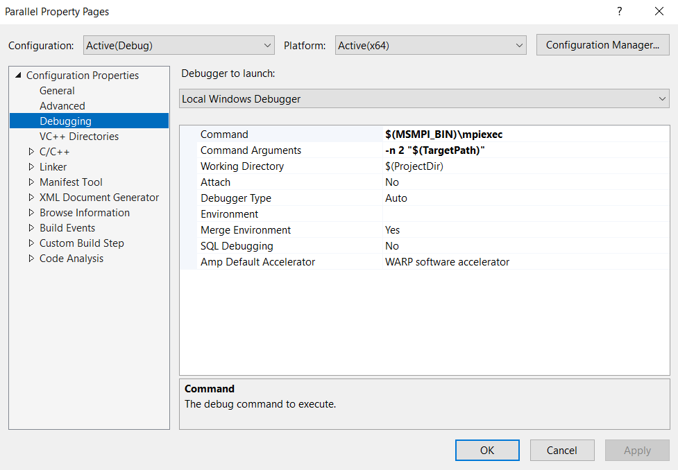

# This project is about determining the frequency of words in a text file and comparing the sequential and parallel implementations

## Table of contents

- [Installation of MS-MPI](#installation-of-ms-mpi)
- [How to run](#how-to-run)

## Installation of MS-MPI

- Download and install both the .msi and .exe files: https://www.microsoft.com/en-us/download/details.aspx?id=105289
- After installing, open Command Prompt and type: set MSMPI

## How to run

It is recommended to run the programs using Visual Studio 2022.

For the parallel program the followings should be added:

The number "2" represents the number of processes and can be replaced with another number.
